# AGENTS.md

This file provides guidance to Verdent when working with code in this repository.

## Table of Contents
1. Commonly Used Commands
2. High-Level Architecture & Structure
3. Key Rules & Constraints
4. Development Hints

## Commands

- `pnpm dev` — Start the Next.js dev server (with webpack)
- `pnpm build` — Build all packages and the Next.js app for production
- `pnpm lint` — Run ESLint across the monorepo
- `pnpm format` — Run Prettier on `**/*.{ts,tsx,md}`
- `pnpm docker:dev` — Run the development environment in Docker Compose
- `pnpm docker:prod` — Run the production environment in Docker Compose
- `pnpm --filter @agent-web/core build` — Build the core package
- `pnpm --filter @agent-web/db build` — Build the db package
- `pnpm --filter @agent-web/db db:push` — Push Drizzle schema to SQLite
- `pnpm --filter @agent-web/db db:studio` — Open Drizzle Studio
- `pnpm test` — Run all tests with Vitest

## Architecture

- **Monorepo layout**: pnpm workspaces (`apps/*`, `packages/*`) orchestrated by Turbo.
- **`apps/web`**: Next.js 16 App Router application. No `src/` folder; pages and API routes live directly under `app/`.
- **`packages/core`**: Shared LLM client, tool registry, and TypeScript types. Built with `tsc` to `dist/`.
- **`packages/db`**: Drizzle ORM schema and libsql client. Built with `tsc` to `dist/`.

### Key Data Flows

1. **Chat Request/Response**:
   - `ChatInterface` (client) -> `useChatStore` (Zustand) -> POST `/api/chat` -> `streamText` (AI SDK v4) -> Vercel AI SDK data stream -> client manually parses stream chunks (`0:` text, `3:` error, `9:` tool call, `a:` tool result, `d:` done) and updates Zustand state.
   - The frontend does **not** use `useChat` from `ai/react`; it uses a custom fetch + `getReader()` loop.

2. **Tool System**:
   - Tools are defined in `packages/core/src/tools/*.ts` and registered in `packages/core/src/tools/registry.ts`.
   - All 8 tools (terminal, read_file, write_file, web_search, web_fetch, list_directory, search_files, execute_code) are **fully active and wired** into the chat API route at `apps/web/app/api/chat/route.ts`.
   - File tools (`read_file`, `write_file`, `list_directory`, `search_files`) are restricted to the project workspace directory via path traversal protection.

3. **Database**:
   - SQLite via libsql (`data/local.db` by default). Schema defines `projects`, `sessions`, `messages`, and `api_keys` tables.
   - The DB is **fully wired into the chat flow**: sessions and messages are persisted via REST API calls with optimistic UI updates.
   - Only UI preferences (sidebar state, provider selection, theme) are persisted to `localStorage` under `"agent-web-ui-prefs"`.

### External Dependencies

- Next.js 16.2.6, React 19.2.4
- AI SDK v4 (`ai`, `@ai-sdk/openai`)
- Zustand v5 (client state)
- Drizzle ORM v0.36 + `@libsql/client`
- Tailwind CSS v3 (configured via `tailwind.config.ts`)
- `react-markdown`, `react-syntax-highlighter` for message rendering

### Development Entry Points

- Web app: `apps/web/app/page.tsx`
- API route: `apps/web/app/api/chat/route.ts`
- LLM client: `packages/core/src/llm/client.ts`
- Tool registry: `packages/core/src/tools/registry.ts`
- DB schema: `packages/db/src/schema.ts`
- Zustand store: `apps/web/lib/store.ts`

### Mermaid Diagram

```mermaid
graph TD
    A[Browser: ChatInterface] -->|POST /api/chat| B[Next.js API Route]
    B --> C[packages/core LLM Client]
    C --> D[AI SDK v4 streamText]
    D --> E[OpenAI / OpenRouter / OpenCode / DeepSeek]
    E -->|Data Stream| D --> B --> A
    C --> F[Tool Registry]
    F --> G[Terminal Tool]
    F --> H[File Tools &#40;read, write, list, search&#41;]
    F --> I[Web Tools &#40;search, fetch&#41;]
    F --> J[Execute Code]
    A --> K[Zustand Store]
    K -->|Persist| L[REST API &#40;/api/sessions, /api/messages&#41;]
    L --> M[packages/db]
    M --> N[(SQLite / libsql)]
    K -->|UI prefs only| O[(localStorage)]
```

## Key Rules & Constraints

- **Package manager**: pnpm@9.0.0 (enforced via `packageManager` field).
- **Next.js 16 breaking changes**: This version has breaking API and convention changes vs. older Next.js versions. Read the relevant guide in `node_modules/next/dist/docs/` before writing code. Heed deprecation notices. (See also `apps/web/AGENTS.md`.)
- **No `src/` in `apps/web`**: The Next.js app uses the App Router directly under `app/`, `components/`, `lib/`, etc.
- **Packages must be built**: `@agent-web/core` and `@agent-web/db` are transpiled via `tsc` and consumed via `transpilePackages` in `next.config.ts`. Always build packages before the web app builds, or run `tsc --watch` in dev.
- **Standalone output**: `next.config.ts` sets `output: "standalone"`. The production Docker image copies the standalone server bundle.
- **Server externals**: `next.config.ts` marks `child_process` and `@libsql/client` as `serverExternalPackages`.
- **Tailwind v3**: Configured via `tailwind.config.ts` with PostCSS plugin `tailwindcss`. Use `tailwind.config.ts` for custom theme values, not `@tailwindcss/postcss`.
- **ESLint**: Uses the new ESLint v9 flat config (`eslint.config.mjs`) with `eslint-config-next/core-web-vitals` and `eslint-config-next/typescript`.
- **Docker targets**: The `Dockerfile` has three targets: `development`, `production`, and `sandbox` (isolated Python / Node.js environment for code execution).
- **Design system**: Follow `apps/web/DESIGN_SYSTEM.md` for colors, spacing, and animation specs. Dark-first design with glassmorphism accents.
- **Path security**: File tools are restricted to the project workspace. Override with `TOOL_ALLOWED_BASE` env var if needed (not recommended for production).

## Development Hints

- **Adding a new LLM provider**:
  1. Add provider config to `packages/core/src/types.ts`.
  2. Add provider branch in `packages/core/src/llm/client.ts` using `createOpenAI({ baseURL: ... })`.
  3. Update the provider list in `apps/web/components/settings-panel.tsx`.
  4. Update the API route (`apps/web/app/api/chat/route.ts`) to accept the new provider.

- **Adding a new tool**:
  1. Define the tool in `packages/core/src/tools/` (e.g., `my-tool.ts`) using `tool()` from the `ai` SDK with a Zod parameter schema.
  2. Register it in `packages/core/src/tools/registry.ts`.
  3. Tools are automatically wired into the chat route via the registry.

- **Working with the database**:
  - The DB client and schema are ready in `packages/db`.
  - Sessions and messages are persisted automatically through the Zustand store's API calls.
  - To reset the database, delete `data/local.db` and restart.

- **Running in Docker on Windows/macOS**:
  - The dev compose file sets `CHOKIDAR_USEPOLLING=true` and `WATCHPACK_POLLING=true` so file watching works inside bind mounts.

- **Testing**:
  - Tests use Vitest with happy-dom.
  - Run `pnpm test` to execute all tests.
  - Run `pnpm test:watch` for watch mode.
  - Run `pnpm test:coverage` for coverage report.

- **Working with deleted files**:
  - A large number of source files were deleted from the working tree but remain in Git history. If you need to reference or restore them, use `git show HEAD:<path>`.
