# AGENTS.md

Guidance to Verdent when working in this repo.

## Commands

- `pnpm dev` — Next.js dev server (webpack)
- `pnpm build` — Build all packages + Next.js prod
- `pnpm lint` — ESLint monorepo
- `pnpm format` — Prettier `**/*.{ts,tsx,md}`
- `pnpm docker:dev` / `pnpm docker:prod` — Docker Compose dev/prod
- `pnpm --filter @agent-web/core build` — Core pkg build
- `pnpm --filter @agent-web/db build` — DB pkg build
- `pnpm --filter @agent-web/db db:push` — Push Drizzle schema to SQLite
- `pnpm --filter @agent-web/db db:studio` — Drizzle Studio
- `pnpm test` — Vitest

## Architecture

- **Monorepo**: pnpm workspaces + Turbo.
- **`apps/web`**: Next.js 16 App Router. No `src/`. Pages/API routes under `app/`.
- **`packages/core`**: LLM client, tool registry, types. `tsc` → `dist/`.
- **`packages/db`**: Drizzle ORM + libsql. `tsc` → `dist/`.

### Data Flows

1. **Chat**: `ChatInterface` → `useChatStore` → POST `/api/chat` → `streamText` (AI SDK v4) → Vercel data stream → client parse chunks (`0:` text, `3:` error, `9:` tool call, `a:` tool result, `d:` done) → Zustand update. No `useChat`.
2. **Tools**: Define in `packages/core/src/tools/*.ts`, register in `registry.ts`. All 8 tools active + wired. File tools restricted to workspace via path traversal protection.
3. **DB**: SQLite/libsql (`data/local.db`). Tables: `projects`, `sessions`, `messages`, `api_keys`. Sessions/messages persisted via REST API + optimistic UI. Only UI prefs in localStorage.

### Dependencies

Next.js 16.2.6, React 19.2.4, AI SDK v4, Zustand v5, Drizzle ORM v0.36, Tailwind v3, `react-markdown` + `react-syntax-highlighter`.

### Entry Points

- Web app: `apps/web/app/page.tsx`
- API route: `apps/web/app/api/chat/route.ts`
- LLM client: `packages/core/src/llm/client.ts`
- Tool registry: `packages/core/src/tools/registry.ts`
- DB schema: `packages/db/src/schema.ts`
- Zustand store: `apps/web/lib/store.ts`

### Mermaid Diagram

```mermaid
graph TD
    A[Browser: ChatInterface] -->|POST /api/chat| B[Next.js API Route]
    B --> C[packages/core LLM Client]
    C --> D[AI SDK v4 streamText]
    D --> E[OpenAI / OpenRouter / OpenCode / DeepSeek]
    E -->|Data Stream| D --> B --> A
    C --> F[Tool Registry]
    F --> G[Terminal Tool]
    F --> H[File Tools &#40;read, write, list, search&#41;]
    F --> I[Web Tools &#40;search, fetch&#41;]
    F --> J[Execute Code]
    A --> K[Zustand Store]
    K -->|Persist| L[REST API &#40;/api/sessions, /api/messages&#41;]
    L --> M[packages/db]
    M --> N[(SQLite / libsql)]
    K -->|UI prefs only| O[(localStorage)]
```

## Key Constraints

- **pnpm@9.0.0** via `packageManager`.
- **Next.js 16** — breaking changes. Read `node_modules/next/dist/docs/`.
- **No `src/`** in `apps/web`. App Router under `app/`, `components/`, `lib/`.
- **Packages must be built** — `@agent-web/core` + `@agent-web/db` via `tsc`, transpiled via `transpilePackages`. Build before web app or run `tsc --watch`.
- **`output: "standalone"`** — prod Docker copies `.next/standalone`.
- **`serverExternalPackages`** — `child_process`, `@libsql/client`.
- **Tailwind v3** — `tailwind.config.ts` + `tailwindcss` PostCSS plugin. Not v4.
- **ESLint v9 flat config** — `eslint-config-next/core-web-vitals` + `typescript`.
- **Dockerfile** targets: `development`, `production`, `sandbox`.
- **Design system**: `apps/web/DESIGN_SYSTEM.md`. Dark-first, glassmorphism, WCAG 2.1 AA.
- **Path security**: File tools restricted to workspace. Override with `TOOL_ALLOWED_BASE`.

## Dev Hints

**New LLM provider**: Add config in `types.ts`, provider branch in `llm/client.ts` via `createOpenAI({ baseURL })`, update `settings-panel.tsx` provider list, update chat route.

**New tool**: Create `packages/core/src/tools/<name>.ts` with `tool()` + Zod. Register in `registry.ts`. Auto-wired.

**DB**: Client + schema ready. Sessions/messages auto-persist via Zustand API calls. Reset: delete `data/local.db` and restart.

**Docker on Windows/macOS**: Dev compose sets `CHOKIDAR_USEPOLLING=true` + `WATCHPACK_POLLING=true`.

**Tests**: Vitest + happy-dom. Commands: `pnpm test`, `pnpm test:watch`, `pnpm test:coverage`.

**Deleted files**: Many source files deleted from tree but remain in git history. Restore with `git show HEAD:<path>`.
